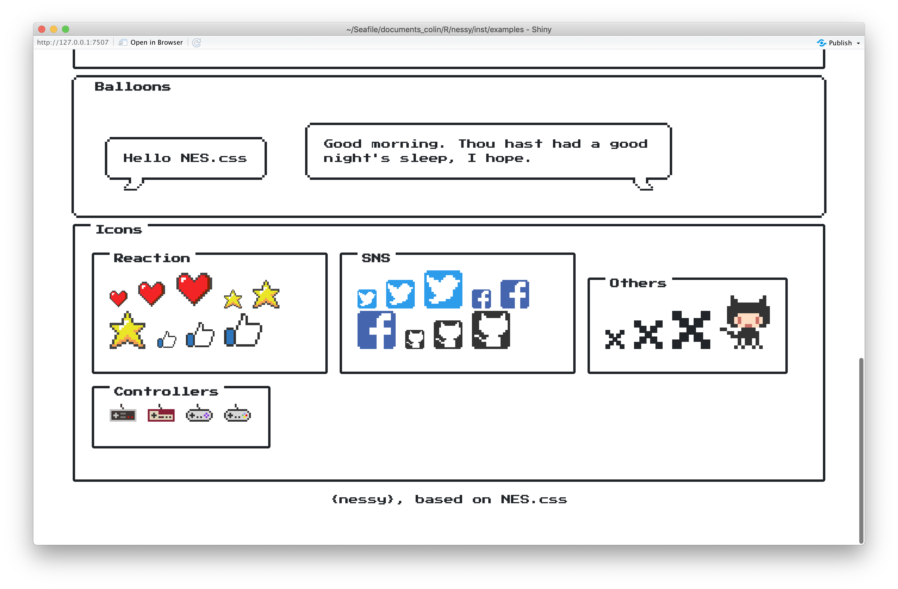

<!-- README.md is generated from README.Rmd. Please edit that file -->

# nessy

A NES css for Shiny.

Note: I did not code the CSS, but brought an existing one to Shiny. Give
the [original css](https://github.com/BcRikko/NES.css) a star if you
like it\!

## Install

``` r
#install.packages("remotes")
remotes::install_github("ColinFay/nessy")
```

## Init

### Starting point

Every new page is launched by the `cartridge()` function. It’s more or
less equivalent to `shiny::fluidPage()`, but with NES CSS loaded.

``` r
library(nessy)

ui <- cartridge(
  title = "{nessy}",
  subtitle = "NES-style CSS Framework for Shiny.",
  footer = "{nessy}, based on NES.css"
)

server <- function(input, output, session) {
  
}

shiny::shinyApp(ui, server)
  
```

### New container

You can simply pass along a `tagList()` of objects. The framed areas are
launched by the `container`, `container_simple` and
`container_with_title` functions.

``` r
library(nessy)

ui <- cartridge(
  title = "{nessy}",
  container_with_title(
      "a container", 
      octocat_animate()
  )
)

server <- function(input, output, session) {
  
}

shiny::shinyApp(ui, server)
  
```


### UI Elements

There are five different buttons & a `radio_buttons()`:

``` r
ui <- cartridge(
  title = "{nessy}",
  container_with_title(
    title = "Buttons",
    button("Normal", "Normal"),
    button_primary("Primary", "Primary"),
    button_success("Success", "Success"),
    button_warning("Warning", "Warning"),
    button_error("Error", "Error"),
    radio_buttons("sure", "Are you sure?", c("yes", "no"))
  )
)

server <- function(input, output, session) {
  
}

shiny::shinyApp(ui, server)
```


You can also find:

  - Balloons
  - Checkbox
  - Text Input
  - Various Icons

## Example

`nessy_examples()` returns the path to all available examples.

``` r
nessy::nessy_examples()
#> [1] "app2.R"       "app3.R"       "app4.R"       "exampleapp.R"
```

You can then:

``` r
shiny::runApp(nessy_examples("exampleapp.R"))
```




Please note that the ‘nessy’ project is released with a [Contributor
Code of Conduct](CODE_OF_CONDUCT.md). By contributing to this project,
you agree to abide by its terms.
